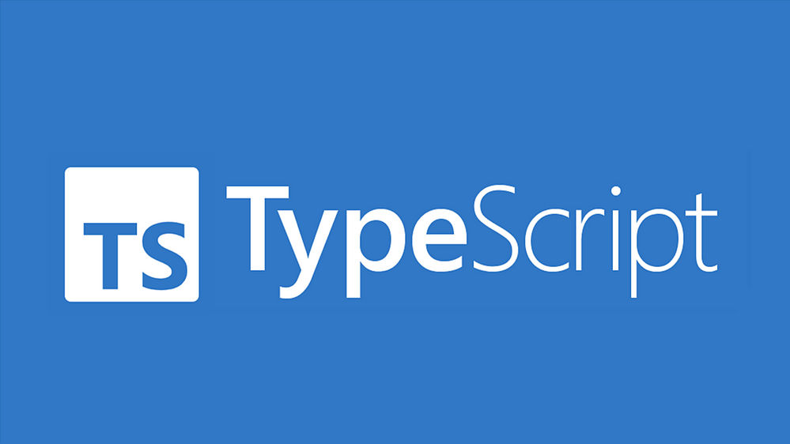

# typescript-learning
Repository dedicated to store TypeScript code during the learning phase.

 

# Notes 
1. Install node.js
2. Install typescript -> npm install -g typescript
3. Install some extensions to help during development/leanring -> TBD
4. Create a index.html file to help compile the code dynamically while the changes are applied